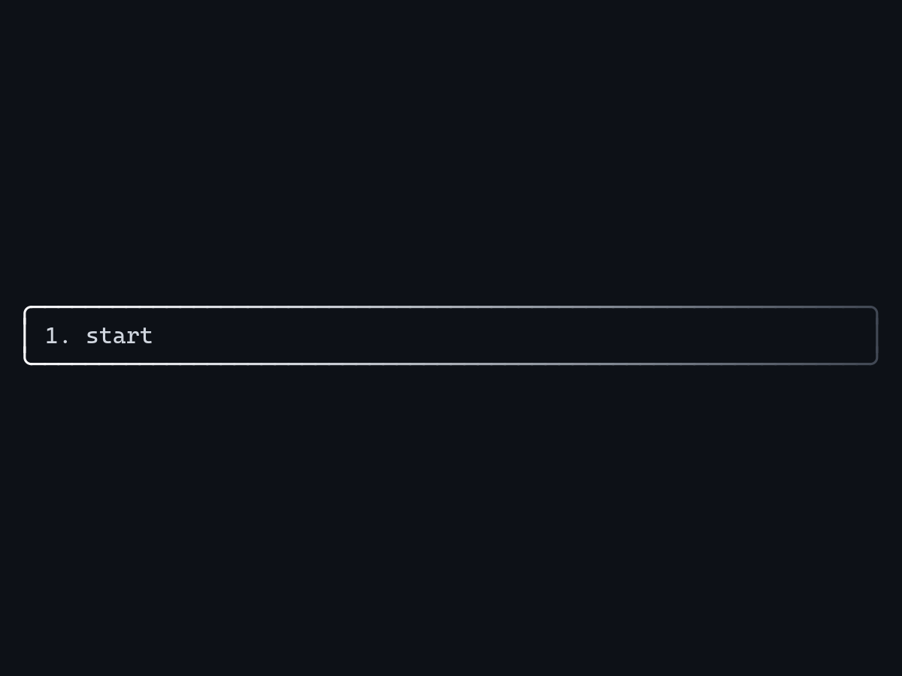
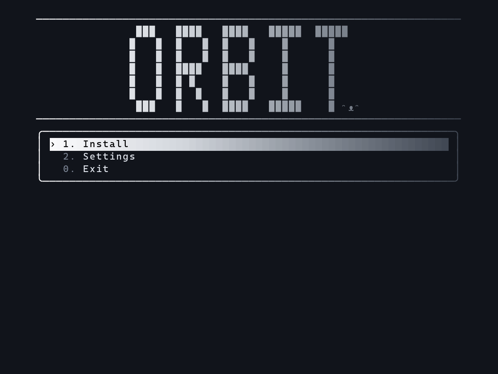
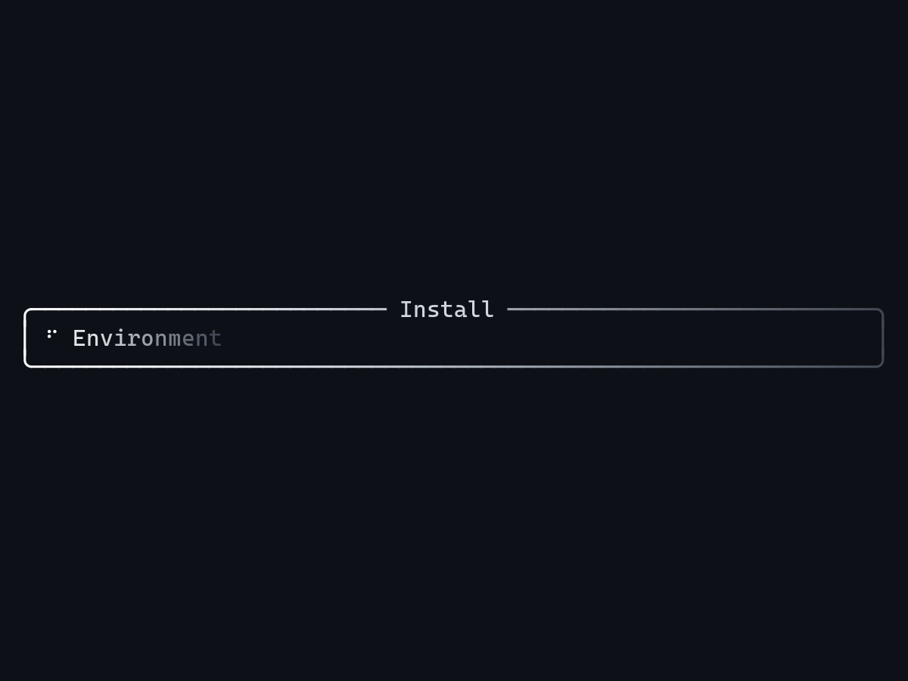
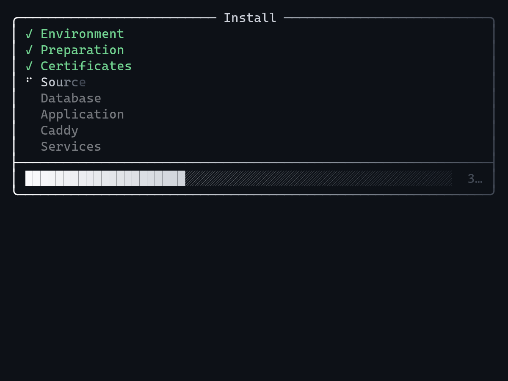
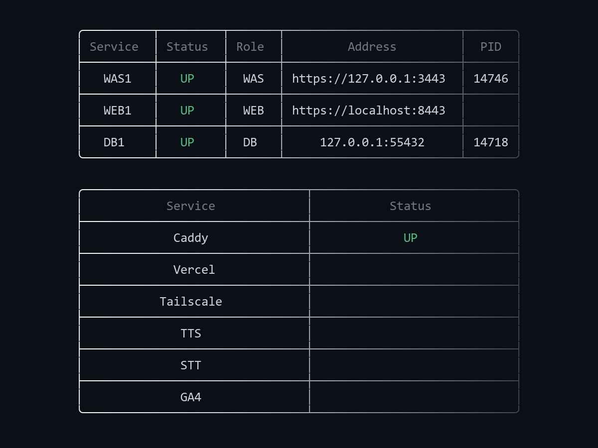
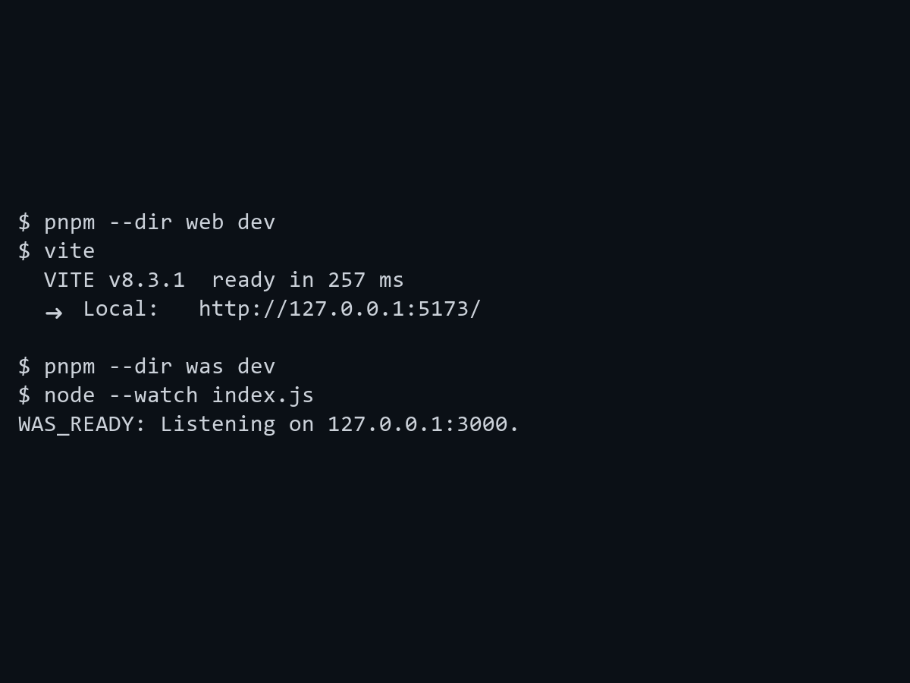
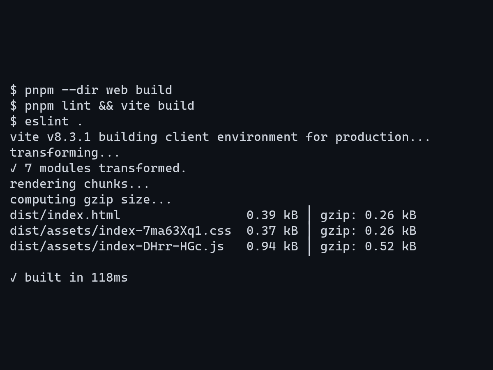

<p align="center">
  
  
</p>

<h1 align="center">🪐 Orbit</h1>

<br>

<p align="center">
  <a href="https://github.com/obabo0801/Orbit/raw/refs/heads/main/.github/assets/cover.png">
    
  </a>
</p>

<br>

<p align="center">
  <a href="https://github.com/obabo0801/Orbit/archive/refs/heads/main.zip">
    
  </a>
</p>

---

<details>
<summary>한국어</summary>

<br>

## 소개

WEB, WAS, DB 를 분리한 웹 프로젝트입니다.<br>
데스크탑, 모바일, 웨어러블을 지원합니다.<br>
Linux, Windows, Mac 을 지원합니다.

---

<details>
<summary>패키지</summary>

<br>

|   이름   |  버전   |      기능       |
| :------: | :-----: | :-------------: |
| Node.js  |   24+   | JavaScript 실행 |
|   pnpm   | 12.8.1  |   패키지 관리   |
|   Vite   |  8.3.1  |    WEB 개발     |
|    pg    | 8.23.0  | PostgreSQL 연결 |
|  ESLint  | 10.11.0 |    코드 검사    |
| Prettier |  3.9.9  |    코드 정리    |

</details>

---

<details>
<summary>기능</summary>

<br>

|    이름    |  상태  |           기능            |
| :--------: | :----: | :-----------------------: |
|  systemd   | 구현됨 |        서비스 관리        |
|  launchd   | 구현됨 |      Mac 서비스 관리      |
|  OpenSSL   | 구현됨 |        인증서 생성        |
| PostgreSQL | 구현됨 | PostgreSQL 18 데이터 저장 |
|   Caddy    | 구현됨 |         WEB 제공          |
|   Vercel   | 구현됨 |        공개 진입점        |
| Tailscale  | 구현됨 |         외부 연결         |
|    TTS     | 미구현 |         음성 합성         |
|    STT     | 미구현 |         음성 인식         |
|    GA4     | 미구현 |         사용 통계         |

</details>

---

<details>
<summary>구조</summary>

<br>

|    경로     |       역할        |
| :---------: | :---------------: |
|   `web/`    |      웹 화면      |
|   `was/`    | 애플리케이션 서버 |
|    `db/`    | 데이터베이스 관리 |
|   `cli/`    |     관리 도구     |
| `start.sh`  |    Linux 시작     |
| `start.bat` |   Windows 시작    |
| `start.sh`  |     Mac 시작      |
|  `stop.sh`  |    Linux 정지     |
| `stop.bat`  |   Windows 정지    |
|  `stop.sh`  |     Mac 정지      |

</details>

---

<details>
<summary>실행</summary>

<br>

### Linux

```sh
./start.sh
./stop.sh
```

### Windows

```powershell
.\start.bat
.\stop.bat
```

### Mac

```sh
./start.sh
./stop.sh
```

### Update

Git Checkout에서 실행합니다. GitHub main을 기준으로 Node를 순서대로 업데이트합니다.<br>
저장하지 않은 변경이나 Push하지 않은 Commit이 있으면 중단합니다.

각 Node의 Git Checkout과 SSH 관리 접속이 준비되어 있어야 합니다.

```sh
node cli/index.js update
node cli/index.js update --check
```

<br>

<p align="center">
  <a href="https://github.com/obabo0801/Orbit/raw/refs/heads/main/.github/assets/run.png">
    
  </a>
</p>

<br>

</details>

---

<details>
<summary>설치</summary>

<br>

### ① 시작

Linux

```sh
./start.sh
```

Windows

```powershell
.\start.bat
```

Mac

```sh
./start.sh
```

<br>

<p align="center">
  <a href="https://github.com/obabo0801/Orbit/raw/refs/heads/main/.github/assets/start.png">
    
  </a>
</p>

<br>

### ② 설치 선택

**설치**를 선택합니다.

<br>

<p align="center">
  <a href="https://github.com/obabo0801/Orbit/raw/refs/heads/main/.github/assets/install.png">
    
  </a>
</p>

<br>

### ③ 설치 준비

- 권한 요청을 승인합니다.
- 실행 환경을 확인하고 필요한 도구를 자동으로 준비합니다.
- macOS 는 Native 설치와 제거를 지원하며 launchd 로 서비스를 관리합니다.

<br>

<p align="center">
  <a href="https://github.com/obabo0801/Orbit/raw/refs/heads/main/.github/assets/preparation.png">
    
  </a>
</p>

<br>

### ④ 설치 진행

- 필요한 도구를 설치하고 웹 화면을 빌드합니다.
- 인증서를 준비하고 서비스를 등록합니다.
- 완료된 단계와 현재 작업을 진행 화면에서 확인합니다.

<br>

<p align="center">
  <a href="https://github.com/obabo0801/Orbit/raw/refs/heads/main/.github/assets/progress.png">
    
  </a>
</p>

<br>

### ⑤ 완료

설치 후 서비스가 시작되고 관리 화면으로 이어집니다.<br>
서비스를 선택하면 상세 상태를 확인합니다.

<br>

<p align="center">
  <a href="https://github.com/obabo0801/Orbit/raw/refs/heads/main/.github/assets/dashboard.png">
    
  </a>
</p>

<br>

</details>

---

<details>
<summary>개발</summary>

<br>

<p align="center">
  <a href="https://github.com/obabo0801/Orbit/raw/refs/heads/main/.github/assets/development.png">
    
  </a>
</p>

<br>

### ① 개발 서버 실행

각 명령을 별도 터미널에서 실행합니다.

```sh
pnpm --dir web dev
pnpm --dir was dev
```

### ② 확인

브라우저에서 변경 내용을 확인합니다.

| 대상 |          주소           |
| :--: | :---------------------: |
| WEB  | <http://127.0.0.1:5173> |
| WAS  | <http://127.0.0.1:3000> |

</details>

---

<details>
<summary>빌드</summary>

<br>

<p align="center">
  <a href="https://github.com/obabo0801/Orbit/raw/refs/heads/main/.github/assets/build.png">
    
  </a>
</p>

<br>

### ① 빌드

```sh
pnpm --dir web build
```

### ② 확인

`web/dist/` 에서 결과를 확인합니다.

</details>

</details>

---

<details>
<summary>English</summary>

<br>

## Introduction

A web project with separate WEB, WAS and DB packages.<br>
Supports desktop, mobile and wearable devices.<br>
Supports Linux, Windows and Mac.

---

<details>
<summary>Packages</summary>

<br>

|   Name   | Version |       Function        |
| :------: | :-----: | :-------------------: |
| Node.js  |   24+   | JavaScript execution  |
|   pnpm   | 12.8.1  |  Package management   |
|   Vite   |  8.3.1  |    WEB development    |
|    pg    | 8.23.0  | PostgreSQL connection |
|  ESLint  | 10.11.0 |      Code checks      |
| Prettier |  3.9.9  |    Code formatting    |

</details>

---

<details>
<summary>Features</summary>

<br>

|    Name    |     Status      |          Function          |
| :--------: | :-------------: | :------------------------: |
|  systemd   |   Implemented   |     Service management     |
|  launchd   |   Implemented   |   Mac service management   |
|  OpenSSL   |   Implemented   |   Certificate generation   |
| PostgreSQL |   Implemented   | PostgreSQL 18 data storage |
|   Caddy    |   Implemented   |        WEB serving         |
|   Vercel   |   Implemented   |        Public entry        |
| Tailscale  |   Implemented   |      External ingress      |
|    TTS     | Not implemented |      Speech synthesis      |
|    STT     | Not implemented |     Speech recognition     |
|    GA4     | Not implemented |      Usage analytics       |

</details>

---

<details>
<summary>Structure</summary>

<br>

|    Path     |       Purpose       |
| :---------: | :-----------------: |
|   `web/`    |    Web interface    |
|   `was/`    | Application server  |
|    `db/`    | Database management |
|   `cli/`    |   Management CLI    |
| `start.sh`  |     Linux Start     |
| `start.bat` |    Windows Start    |
| `start.sh`  |      Mac Start      |
|  `stop.sh`  |     Linux Stop      |
| `stop.bat`  |    Windows Stop     |
|  `stop.sh`  |      Mac Stop       |

</details>

---

<details>
<summary>Run</summary>

<br>

### Linux

```sh
./start.sh
./stop.sh
```

### Windows

```powershell
.\start.bat
.\stop.bat
```

### Mac

```sh
./start.sh
./stop.sh
```

### Update

Run from a Git checkout. Nodes are updated in order from GitHub main.<br>
Pending changes or unpushed commits stop the update.

Each node requires a Git checkout and SSH management access.

```sh
node cli/index.js update
node cli/index.js update --check
```

<br>

<p align="center">
  <a href="https://github.com/obabo0801/Orbit/raw/refs/heads/main/.github/assets/run.png">
    
  </a>
</p>

<br>

</details>

---

<details>
<summary>Install</summary>

<br>

### ① Start

Linux

```sh
./start.sh
```

Windows

```powershell
.\start.bat
```

Mac

```sh
./start.sh
```

<br>

<p align="center">
  <a href="https://github.com/obabo0801/Orbit/raw/refs/heads/main/.github/assets/start.png">
    
  </a>
</p>

<br>

### ② Select Install

Select **Install**.

<br>

<p align="center">
  <a href="https://github.com/obabo0801/Orbit/raw/refs/heads/main/.github/assets/install.png">
    
  </a>
</p>

<br>

### ③ Preparation

- Approve the permission request.
- The environment is checked and required tools are prepared automatically.
- macOS supports native installation and uninstallation with launchd service management.

<br>

<p align="center">
  <a href="https://github.com/obabo0801/Orbit/raw/refs/heads/main/.github/assets/preparation.png">
    
  </a>
</p>

<br>

### ④ Install

- Required tools are installed and the web interface is built.
- Certificates are prepared and services are registered.
- Follow completed steps and the current task in the progress view.

<br>

<p align="center">
  <a href="https://github.com/obabo0801/Orbit/raw/refs/heads/main/.github/assets/progress.png">
    
  </a>
</p>

<br>

### ⑤ Complete

Services start after installation and the dashboard opens.<br>
Select a service to view its details.

<br>

<p align="center">
  <a href="https://github.com/obabo0801/Orbit/raw/refs/heads/main/.github/assets/dashboard.png">
    
  </a>
</p>

<br>

</details>

---

<details>
<summary>Development</summary>

<br>

<p align="center">
  <a href="https://github.com/obabo0801/Orbit/raw/refs/heads/main/.github/assets/development.png">
    
  </a>
</p>

<br>

### ① Run development servers

Run each command in a separate terminal.

```sh
pnpm --dir web dev
pnpm --dir was dev
```

### ② Check

Check changes in your browser.

| Target |         Address         |
| :----: | :---------------------: |
|  WEB   | <http://127.0.0.1:5173> |
|  WAS   | <http://127.0.0.1:3000> |

</details>

---

<details>
<summary>Build</summary>

<br>

<p align="center">
  <a href="https://github.com/obabo0801/Orbit/raw/refs/heads/main/.github/assets/build.png">
    
  </a>
</p>

<br>

### ① Build

```sh
pnpm --dir web build
```

### ② Check

Check the output in `web/dist/`.

</details>

</details>

---

## Contact

- **Email** [obabo0801@gmail.com](mailto:obabo0801@gmail.com)
- **Discord** `unjongjjing`

---

## License

[MIT License](LICENSE)

---
